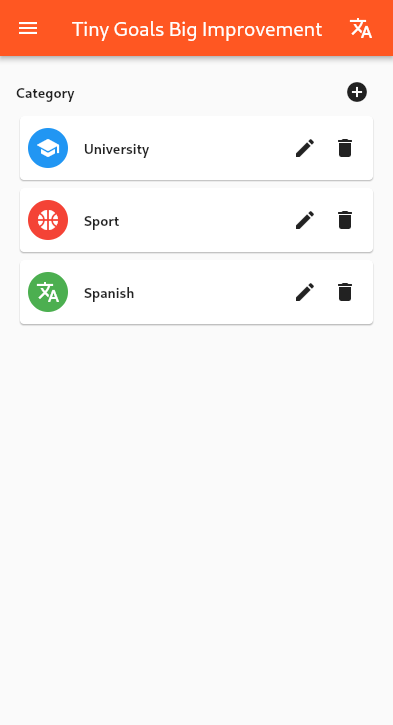
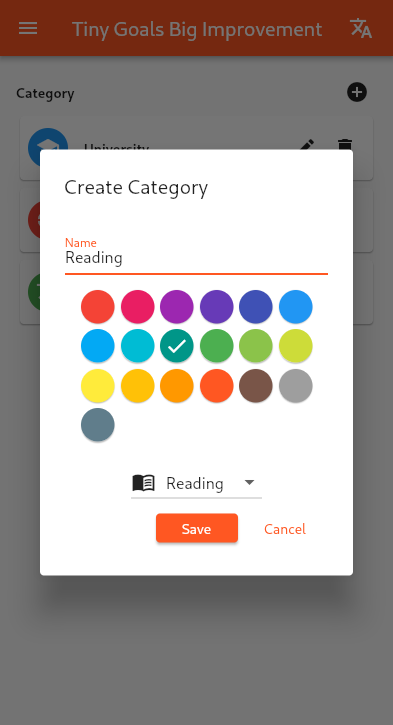
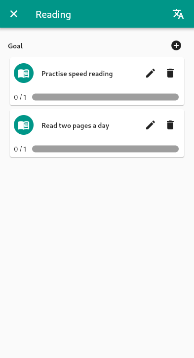
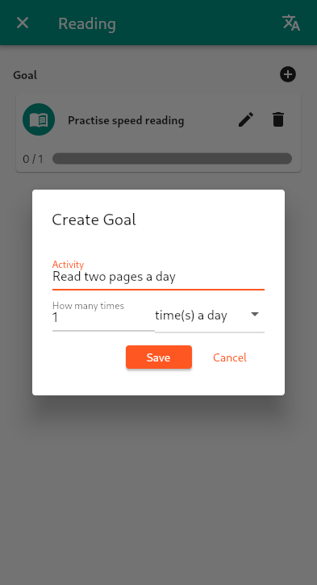
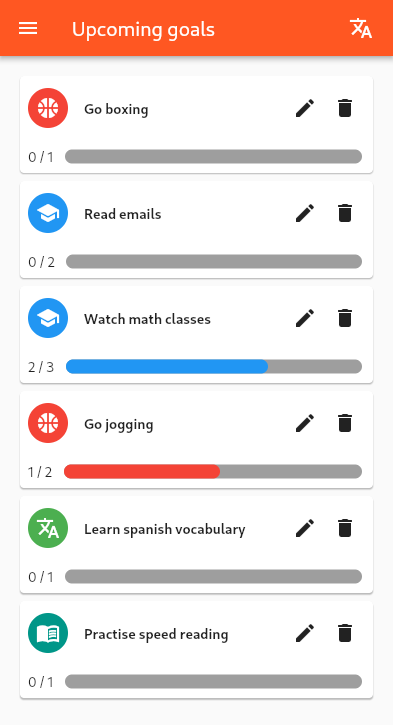
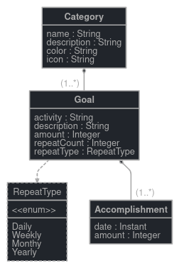

# TinyGoalsBigImprovements

> The goal of the app is to improve productivity in self improving tasks by setting utterly embarrasingly tiny goals a week. These goals lead to productivity boosts in tasks like workout, reading, studying, development, etc. One of such goal would be: do ten push ups a day, read two pages a day, run once around your house, etc.

<!-- vscode-markdown-toc -->
* 1. [ The app](#Theapp)
	* 1.1. [Usage](#Usage)
	* 1.2. [Features](#Features)
		* 1.2.1. [Listing upcoming goals](#Listingupcominggoals)
		* 1.2.2. [Internationalisation](#Internationalisation)
	* 1.3. [Screenshots](#Screenshots)
* 2. [Project structure and setup](#Projectstructureandsetup)
	* 2.1. [How to run and build the application](#Howtorunandbuildtheapplication)
		* 2.1.1. [Run the application in development mode](#Runtheapplicationindevelopmentmode)
		* 2.1.2. [Build the project](#Buildtheproject)
		* 2.1.3. [Test the project](#Testtheproject)
	* 2.2. [Domain models](#Domainmodels)
	* 2.3. [Software architecture](#Softwarearchitecture)
		* 2.3.1. [Responsibilities](#Responsibilities)
		* 2.3.2. [Dependencies](#Dependencies)
* 3. [Project design and structure](#Projectdesignandstructure)

<!-- vscode-markdown-toc-config
	numbering=true
	autoSave=true
	/vscode-markdown-toc-config -->
<!-- /vscode-markdown-toc -->

##  1. <a name='Theapp'></a> The app

###  1.1. <a name='Usage'></a>Usage

The app currently helps you too keep track of daily, weekly, monthly and yearly goals.
You can create categories, in which you can create goals that are based daily, weekly, monthly or yearly.
Then you can see an overview over all of your goals and enter, that you've accomplished a goal.

###  1.2. <a name='Features'></a>Features

> A list of all features appart of the main use cases

####  1.2.1. <a name='Listingupcominggoals'></a>Listing upcoming goals

In the `upcoming` view you can see all upcoming goals ordered by their amount, left to accomplish. Also, fully reached goals are not present in this list.

####  1.2.2. <a name='Internationalisation'></a>Internationalisation

The app supports both english and german. You can switch the language by pressing the language icon on the top right in the appbar and select your prefered language. The app will automatically restart and save your selection.

###  1.3. <a name='Screenshots'></a>Screenshots

A list of all categories:



Creation of a new category:



A list of all goals on the category "reading":



Creation of a new goal:



List of all upcoming goals:



##  2. <a name='Projectstructureandsetup'></a>Project structure and setup

###  2.1. <a name='Howtorunandbuildtheapplication'></a>How to run and build the application

####  2.1.1. <a name='Runtheapplicationindevelopmentmode'></a>Run the application in development mode

Go into the directory `tiny_goals_big_improvements` and run one of these commands:

```bash
flutter run -d windows # on windows
flutter run -d linux   # on linux
flutter run -d android # on android
```

####  2.1.2. <a name='Buildtheproject'></a>Build the project

Go into the directory `tiny_goals_big_improvements` and run this command:

```bash
flutter build apk --no-tree-shake-icons # build for android
```

The build file goes into `tiny_goals_big_improvements/build/app/outputs/flutter-apk`.

We need to add the `--no-tree-shake-icons` flag because we use dynamic icons.

####  2.1.3. <a name='Testtheproject'></a>Test the project

Go into the directory `tiny_goals_big_improvements` and run this command:

```bash
flutter test
```

###  2.2. <a name='Domainmodels'></a>Domain models



###  2.3. <a name='Softwarearchitecture'></a>Software architecture

####  2.3.1. <a name='Responsibilities'></a>Responsibilities

**Repository**

The communication to the database happends in `tiny_goals_big_improvements/lib/repository`


**Database connection**

The database connection will get setup in `tiny_goals_big_improvements/lib/repository/database.dart`.

####  2.3.2. <a name='Dependencies'></a>Dependencies

**Database**

We use `sqflite` for the database communicaion.

##  3. <a name='Projectdesignandstructure'></a>Project design and structure

